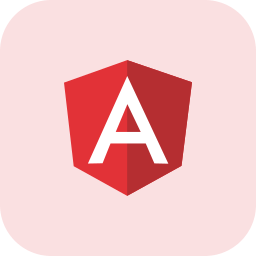
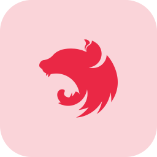
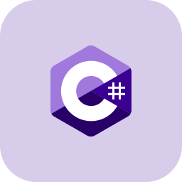
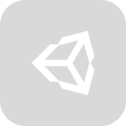

# Hey, Vinícius here ✌🏽

Hi there, I'm a backend developer. I actually started programming during the early days of the COVID-19 pandemic when I participated on a DnD campaign on Discord. I quickly realized that the bots available at the time weren't meeting my expectations, so I set out to create my own bot using Python and ~~the now archived~~ discord.py library.

Although I initially struggled with writing code from scratch (and nearly threw my computer out the window a few times), I eventually dove into the documentation and discovered a newfound love for programming.

Currently, I'm working on a variety of new projects and am excited to connect with like-minded individuals in the community. I'm always on the lookout for opportunities to learn, exploring new technologies and frameworks as I continue to grow as a developer...

## Nowadays 📅

- 🐈‍⬛ Studying NestJs 🐈‍⬛
- 🦀 Studying Rust 🦀
- 🧑🏽‍💻 Doing some small projects 🧑🏽‍💻
- 🤖 Looking for friends 🤖

My favorite technologies

<a href="https://www.typescriptlang.org/" target="_blank">

<a href="https://angular.io/" target="_blank">

<a href="https://nestjs.com/" target="_blank">

<a href="https://tailwindcss.com/" target="_blank">

<a href="https://www.mongodb.com/" target="_blank">

<a href="https://www.python.org/" target="_blank">

 

<a href="https://learn.microsoft.com/en-us/dotnet/csharp/" target="_blank">

<a href="https://learn.microsoft.com/en-us/dotnet/csharp/" target="_blank">

<a href="https://code.visualstudio.com/" target="_blank">

 

## I'm everywhere! 🌎

- I'm showing my learning in <a href="https://dev.to/vinic">Dev.to</a>
- A complete ghost on <a href="https://twitter.com/viniciusithalo">Twitter</a>
- Somehow existing in <a href="https://www.linkedin.com/in/vinithalo">LinkedIn</a>

<!--
I wasn't sure where to fit it, but except for a few icons that I made myself, I don't own any of this stuff. Actually found them at Amit Kumar github profile. Go there take a look!

https://github.com/amitkumarhq
-->
